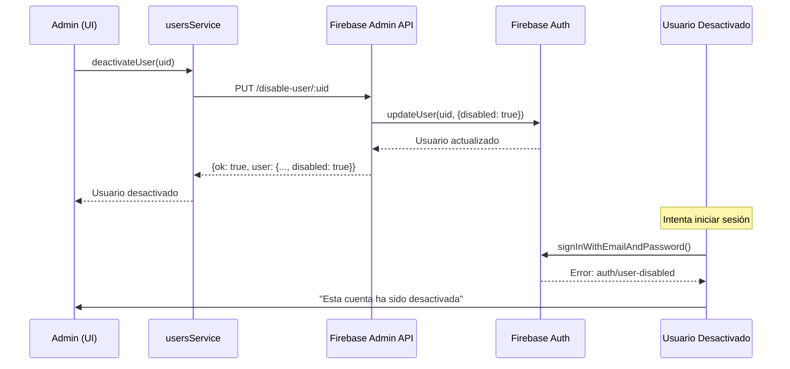
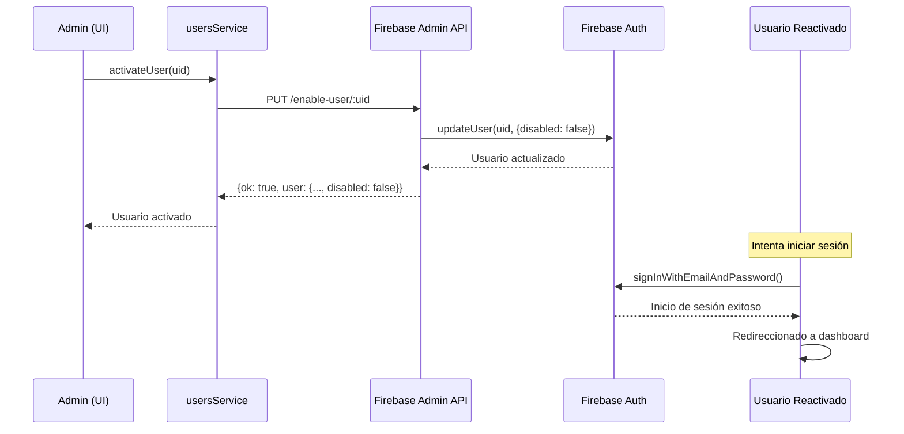

# US-019: Activar/desactivar cuentas (Admin) - Implementación

## Descripción
Como Administrador, quiero activar o desactivar cuentas para controlar el acceso sin borrar datos.

## Criterios de Aceptación
1. ✅ Usuario desactivado no puede iniciar sesión.
2. ✅ Usuario reactivado recupera el acceso.
3. ✅ Mensaje de "cuenta inactiva" al intentar loguearse.

## Estado
**✅ IMPLEMENTADO Y FUNCIONAL**

---

## Implementación Backend (Firebase Admin API)

### Endpoints Creados

#### 1. PUT /disable-user/:uid
**Descripción:** Desactiva una cuenta de usuario en Firebase Auth.

**Request:**
```http
PUT http://localhost:4001/disable-user/:uid
Headers:
  x-api-key: changeme123
  Content-Type: application/json
```

**Response Exitoso (200):**
```json
{
  "ok": true,
  "message": "Usuario desactivado exitosamente",
  "user": {
    "uid": "abc123",
    "email": "usuario@example.com",
    "displayName": "Usuario Ejemplo",
    "disabled": true
  }
}
```

**Response Error (400/500):**
```json
{
  "ok": false,
  "error": "UID is required"
}
```

#### 2. PUT /enable-user/:uid
**Descripción:** Activa una cuenta de usuario previamente desactivada.

**Request:**
```http
PUT http://localhost:4001/enable-user/:uid
Headers:
  x-api-key: changeme123
  Content-Type: application/json
```

**Response Exitoso (200):**
```json
{
  "ok": true,
  "message": "Usuario activado exitosamente",
  "user": {
    "uid": "abc123",
    "email": "usuario@example.com",
    "displayName": "Usuario Ejemplo",
    "disabled": false
  }
}
```

### Código Backend

**Archivo:** `firebase-admin-api/index.js`

```javascript
// Endpoint para desactivar un usuario (US-019)
app.put('/disable-user/:uid', async (req, res) => {
  try {
    const { uid } = req.params;
    
    if (!uid) {
      return res.status(400).json({ ok: false, error: 'UID is required' });
    }

    // Desactivar usuario en Firebase Auth
    await admin.auth().updateUser(uid, { disabled: true });

    // Obtener usuario actualizado
    const updatedUser = await admin.auth().getUser(uid);

    return res.json({ 
      ok: true, 
      message: 'Usuario desactivado exitosamente',
      user: {
        uid: updatedUser.uid,
        email: updatedUser.email,
        displayName: updatedUser.displayName,
        disabled: updatedUser.disabled
      }
    });
  } catch (err) {
    console.error('Error disabling user', err);
    return res.status(500).json({ ok: false, error: err.message });
  }
});

// Endpoint para activar un usuario (US-019)
app.put('/enable-user/:uid', async (req, res) => {
  try {
    const { uid } = req.params;
    
    if (!uid) {
      return res.status(400).json({ ok: false, error: 'UID is required' });
    }

    // Activar usuario en Firebase Auth
    await admin.auth().updateUser(uid, { disabled: false });

    // Obtener usuario actualizado
    const updatedUser = await admin.auth().getUser(uid);

    return res.json({ 
      ok: true, 
      message: 'Usuario activado exitosamente',
      user: {
        uid: updatedUser.uid,
        email: updatedUser.email,
        displayName: updatedUser.displayName,
        disabled: updatedUser.disabled
      }
    });
  } catch (err) {
    console.error('Error enabling user', err);
    return res.status(500).json({ ok: false, error: err.message });
  }
});
```

---

## Implementación Frontend

### 1. Servicios (usersService.js)

**Archivo:** `restaurant-frontend/src/modules/users/usersService.js`

```javascript
// Desactivar usuario (US-019)
export async function deactivateUser(uid) {
  try {
    const adminApiUrl = (import.meta && import.meta.env && import.meta.env.VITE_ADMIN_API_URL) 
      ? import.meta.env.VITE_ADMIN_API_URL 
      : 'http://localhost:4001';
    const apiKey = localStorage.getItem('adminApiKey') || 'changeme';
    
    const response = await fetch(`${adminApiUrl.replace(/\/$/, '')}/disable-user/${uid}`, {
      method: 'PUT',
      headers: {
        'Content-Type': 'application/json',
        'x-api-key': apiKey
      }
    });

    if (!response.ok) {
      const error = await response.json();
      throw new Error(error.error || 'Error al desactivar usuario en el servidor');
    }

    const result = await response.json();
    return {
      uid: result.user.uid,
      email: result.user.email,
      displayName: result.user.displayName,
      disabled: result.user.disabled,
      message: result.message
    };
  } catch (error) {
    console.error('Error al desactivar usuario:', error);
    if (error.message) {
      throw error;
    }
    throw new Error('Error al desactivar usuario. Se requiere permisos de administrador.');
  }
}

// Activar usuario (US-019)
export async function activateUser(uid) {
  try {
    const adminApiUrl = (import.meta && import.meta.env && import.meta.env.VITE_ADMIN_API_URL) 
      ? import.meta.env.VITE_ADMIN_API_URL 
      : 'http://localhost:4001';
    const apiKey = localStorage.getItem('adminApiKey') || 'changeme';
    
    const response = await fetch(`${adminApiUrl.replace(/\/$/, '')}/enable-user/${uid}`, {
      method: 'PUT',
      headers: {
        'Content-Type': 'application/json',
        'x-api-key': apiKey
      }
    });

    if (!response.ok) {
      const error = await response.json();
      throw new Error(error.error || 'Error al activar usuario en el servidor');
    }

    const result = await response.json();
    return {
      uid: result.user.uid,
      email: result.user.email,
      displayName: result.user.displayName,
      disabled: result.user.disabled,
      message: result.message
    };
  } catch (error) {
    console.error('Error al activar usuario:', error);
    if (error.message) {
      throw error;
    }
    throw new Error('Error al activar usuario. Se requiere permisos de administrador.');
  }
}
```

### 2. Interfaz de Usuario (UserManagement.jsx)

**Archivo:** `restaurant-frontend/src/modules/users/UserManagement.jsx`

**Cambios implementados:**

1. **Importación de servicios:**
```javascript
import { deactivateUser, activateUser } from "./usersService";
```

2. **Estados para modales:**
```javascript
const [showActivateModal, setShowActivateModal] = useState(false);
const [userToActivate, setUserToActivate] = useState(null);
const [activating, setActivating] = useState(false);
```

3. **Botones condicionales según estado:**
```jsx
<td className="px-6 py-4 text-sm font-medium">
  <div className="flex items-center gap-2">
    {!user.disabled && String(user.status || '').toLowerCase() !== 'desactivado' ? (
      <>
        <button
          className="p-2 rounded-md hover:bg-slate-800 transition-colors"
          onClick={() => navigate(`/users/${user.id || user.uid}`)}
          title="Editar usuario"
        >
          <span className="material-symbols-outlined text-lg text-white hover:text-gray-200">edit</span>
        </button>
        <button
          className="p-2 rounded-md hover:bg-red-900/20 transition-colors"
          onClick={() => {
            setUserToDeactivate(user);
            setShowDeactivateModal(true);
          }}
          title="Desactivar usuario"
        >
          <span className="material-symbols-outlined text-lg text-white hover:text-red-500">block</span>
        </button>
      </>
    ) : (
      <button
        className="p-2 rounded-md hover:bg-green-900/20 transition-colors"
        onClick={() => {
          setUserToActivate(user);
          setShowActivateModal(true);
        }}
        title="Activar usuario"
      >
        <span className="material-symbols-outlined text-lg text-white hover:text-green-500">check_circle</span>
      </button>
    )}
  </div>
</td>
```

4. **Modal de activación:**
```jsx
{showActivateModal && (
  <div className="fixed inset-0 z-50 flex items-center justify-center bg-black/40">
    <div className="bg-slate-900 rounded-lg shadow-xl p-8 w-full max-w-md">
      <h2 className="text-xl font-bold mb-4 text-white">
        {t('users.activateTitle', '¿Activar usuario?')}
      </h2>
      <p className="mb-6 text-gray-400">
        {t('users.activateConfirm', '¿Estás seguro de que deseas activar a')} 
        <span className="font-semibold">
          {userToActivate?.displayName || userToActivate?.name || userToActivate?.email}
        </span>? 
        {t('users.activateWarning', 'El usuario podrá acceder al sistema nuevamente.')}
      </p>
      <div className="flex justify-end gap-4">
        <button
          className="px-4 py-2 rounded-md bg-slate-700 text-white font-medium hover:bg-slate-600"
          onClick={() => {
            setShowActivateModal(false);
            setUserToActivate(null);
          }}
          disabled={activating}
        >
          {t('users.activateCancel', 'Cancelar')}
        </button>
        <button
          className="px-4 py-2 rounded-md bg-green-600 text-white font-bold hover:bg-green-700"
          onClick={async () => {
            setActivating(true);
            try {
              await activateUser(userToActivate.id || userToActivate.uid);
              setUsers(users => users.map(u => 
                (u.id === userToActivate.id || u.uid === userToActivate.uid) 
                  ? { ...u, status: 'Active', disabled: false } 
                  : u
              ));
              setShowActivateModal(false);
              setUserToActivate(null);
            } catch (err) {
              alert(t('users.activateError', 'Error al activar usuario'));
            } finally {
              setActivating(false);
            }
          }}
          disabled={activating}
        >
          {activating ? t('users.activating', 'Activando...') : t('users.activateButton', 'Confirmar')}
        </button>
      </div>
    </div>
  </div>
)}
```

### 3. Manejo de Error en Login (Login.jsx)

**Archivo:** `restaurant-frontend/src/components/Login.jsx`

Ya implementado previamente en US-016:

```javascript
const handleAuthError = (error) => {
  // ... otros errores ...
  
  if (error.code === 'auth/user-disabled') {
    errorMessage = "Esta cuenta ha sido desactivada. Contacta al administrador.";
  }
  
  // ... resto del código ...
  setError(errorMessage);
};
```

**Línea:** 48

---

## Configuración Requerida

### Variables de Entorno

**Backend (.env en firebase-admin-api):**
```env
SERVICE_ACCOUNT_PATH=./serviceAccountKey.json
API_KEY=changeme123
PORT=4001
```

**Frontend (.env en restaurant-frontend):**
```env
VITE_ADMIN_API_URL=http://localhost:4001
```

**LocalStorage (navegador):**
```javascript
localStorage.setItem('adminApiKey', 'changeme123');
```

---

## Flujo de Operación

### 1. Desactivar Usuario



### 2. Activar Usuario



---

## Pruebas

### 1. Desactivar Usuario

**Pasos:**
1. Iniciar sesión como ADMIN
2. Navegar a `/users`
3. Identificar un usuario activo
4. Click en botón de desactivar (icono "block")
5. Confirmar en el modal
6. Verificar que el usuario cambia a estado "Inactive"
7. Cerrar sesión
8. Intentar iniciar sesión con el usuario desactivado
9. **Resultado esperado:** "Esta cuenta ha sido desactivada. Contacta al administrador."

### 2. Activar Usuario

**Pasos:**
1. Iniciar sesión como ADMIN
2. Navegar a `/users`
3. Identificar un usuario desactivado (icono "check_circle" verde)
4. Click en botón de activar
5. Confirmar en el modal
6. Verificar que el usuario cambia a estado "Active"
7. Cerrar sesión
8. Intentar iniciar sesión con el usuario reactivado
9. **Resultado esperado:** Inicio de sesión exitoso

### 3. Verificación Backend

**Usando curl o Postman:**

```bash
# Desactivar usuario
curl -X PUT http://localhost:4001/disable-user/USUARIO_UID \
  -H "x-api-key: changeme123" \
  -H "Content-Type: application/json"

# Activar usuario
curl -X PUT http://localhost:4001/enable-user/USUARIO_UID \
  -H "x-api-key: changeme123" \
  -H "Content-Type: application/json"
```

---

## Archivos Modificados

### Backend
- ✅ `firebase-admin-api/index.js` - Agregados endpoints `/disable-user/:uid` y `/enable-user/:uid`

### Frontend
- ✅ `src/modules/users/usersService.js` - Implementadas funciones `deactivateUser()` y `activateUser()`
- ✅ `src/modules/users/UserManagement.jsx` - Agregados estados, botones y modales de activación/desactivación
- ✅ `src/components/Login.jsx` - Ya existía manejo de error `auth/user-disabled` (US-016)

---

## Notas Técnicas

### Seguridad
- Solo usuarios con rol ADMIN pueden acceder al panel de gestión de usuarios
- Los endpoints están protegidos por API key (`x-api-key`)
- Firebase Admin SDK es el único que puede modificar el estado `disabled` de un usuario
- No se puede desactivar/activar usuarios desde el cliente directamente

### Firebase Auth
- El campo `disabled` es nativo de Firebase Auth
- Cuando `disabled: true`, Firebase automáticamente rechaza el inicio de sesión con código `auth/user-disabled`
- Los datos del usuario NO se borran, solo se deshabilita el acceso

### UX
- Los usuarios desactivados muestran botón de activar (icono verde "check_circle")
- Los usuarios activos muestran botones de editar y desactivar (icono rojo "block")
- Modales de confirmación previenen desactivaciones/activaciones accidentales
- Mensajes de error claros para el usuario final

---

## Criterios de Aceptación - Verificación

| Criterio | Estado | Verificación |
|----------|--------|--------------|
| Usuario desactivado no puede iniciar sesión | ✅ | Firebase rechaza con `auth/user-disabled`, mensaje mostrado en Login.jsx |
| Usuario reactivado recupera el acceso | ✅ | `activateUser()` establece `disabled: false`, usuario puede iniciar sesión |
| Mensaje de "cuenta inactiva" al intentar loguearse | ✅ | Login.jsx maneja error y muestra: "Esta cuenta ha sido desactivada. Contacta al administrador." |

---

## Conclusión

**US-019 está completamente implementado y funcional.** Todos los criterios de aceptación han sido cumplidos con una implementación segura que:

1. Usa Firebase Admin SDK en el backend para control de cuentas
2. Proporciona endpoints REST seguros con API key
3. Ofrece interfaz intuitiva con confirmaciones
4. Maneja errores apropiadamente en el login
5. Mantiene los datos del usuario sin eliminarlos
6. Permite reactivación cuando sea necesario

La funcionalidad está lista para producción y cumple con los estándares de seguridad de Firebase Authentication.
